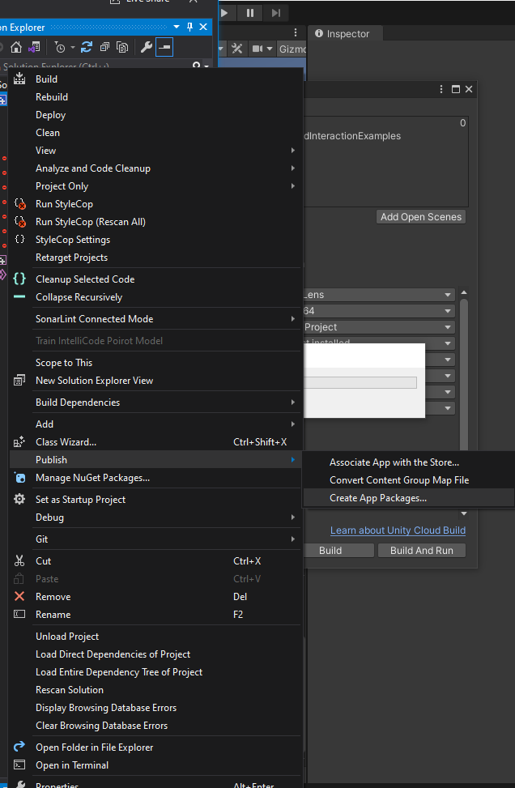
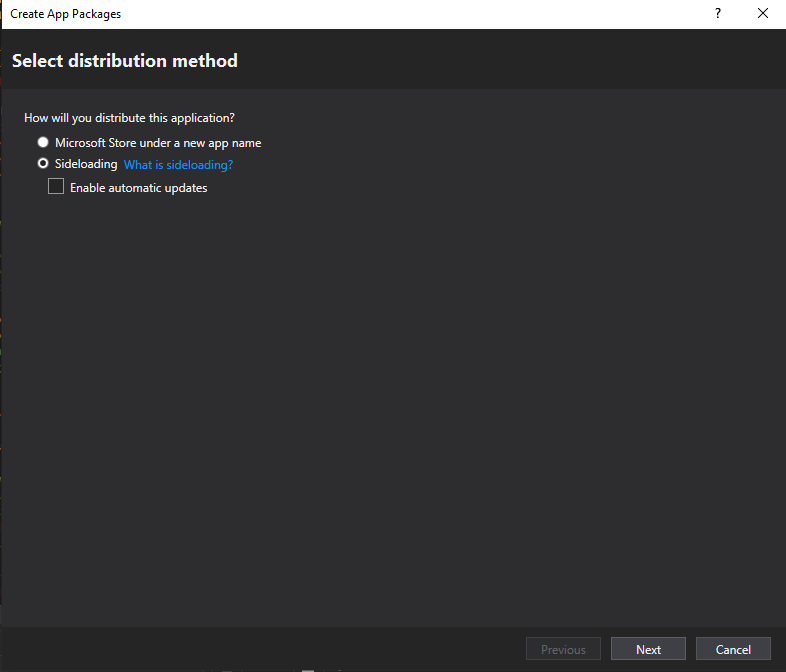
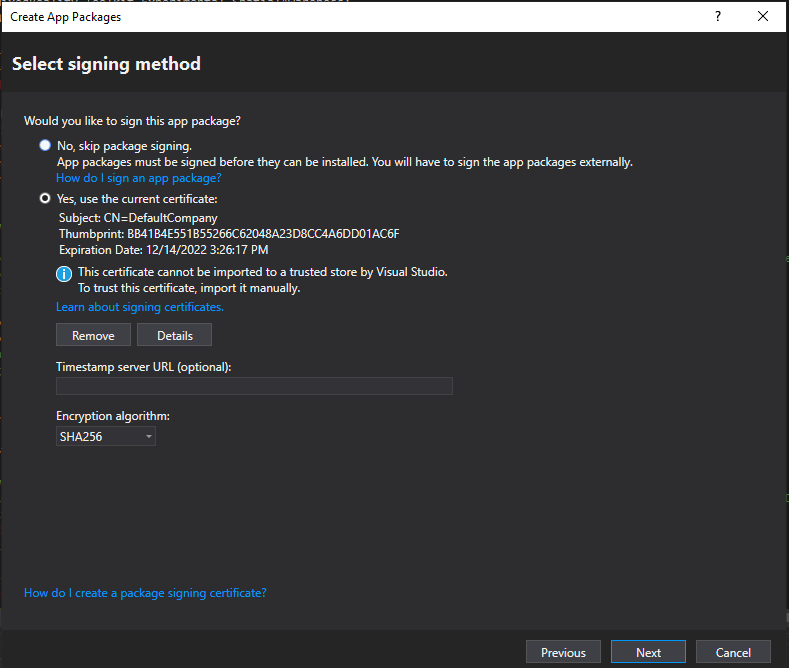
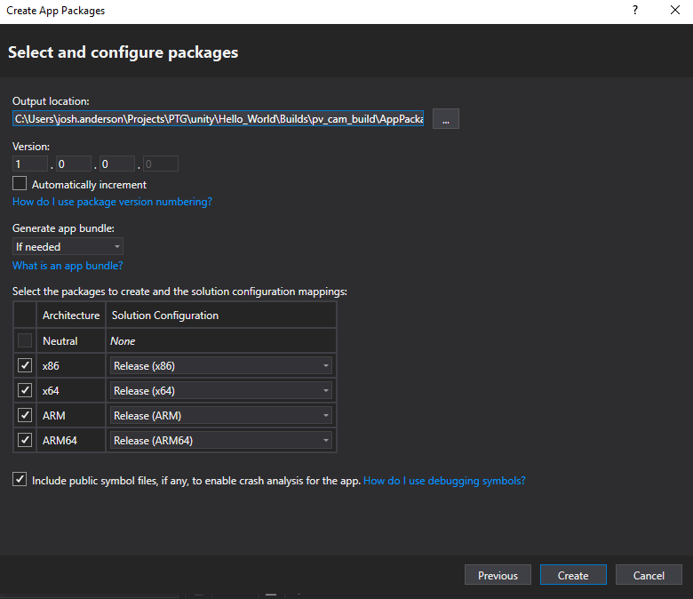
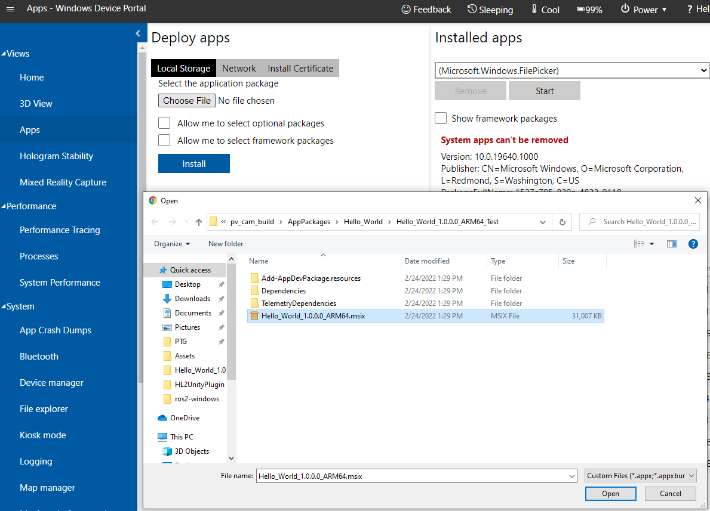

# Creating an app package
1) Build the application as usual within Unity.
2) In the Visual Studio project, right-click the project in the Solution Explorer and select `Publish -> Create App Packages...`

3) In the app package window, select `Sideloading`, uncheck the `Enable automatic updates` box, and click `Next`.

4) Ensure the app certificate is signed and click `Next`. The default certificate settings are OK.

5) Choose the app's output location and ensure the ARM64 architecture is selected. Click `Create` to create the package.

# Installing package via the device portal
Follow the installation steps from the [Windows Device Portal Documentation](https://docs.microsoft.com/en-us/windows/mixed-reality/develop/advanced-concepts/using-the-windows-device-portal#installing-an-app).

Select the .msix file in the ARM64 folder in the app package created previously.
Note you will need to remove any previously installed apps of the same name. This can be done in the device portal Apps view by selecting the app in the Installed apps window and clicking `Remove`.

